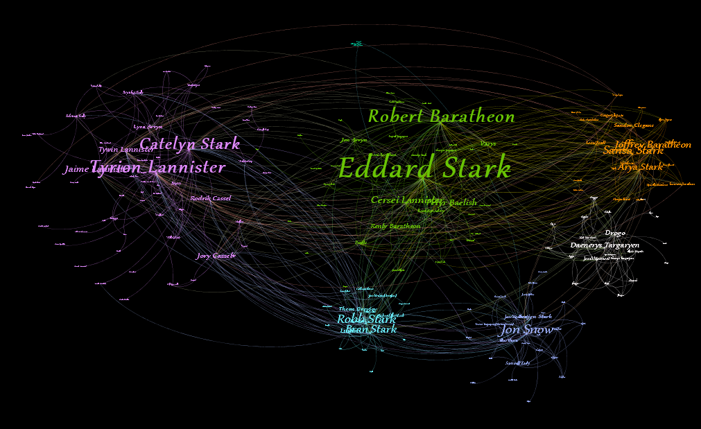

# Social Network Analysis  

# Group member
* **Nguyen Hoang An** - *18520430@gm.uit.edu.vn*
* **Duong Trong Van** - *18521630@gm.uit.edu.vn*

# Table of contents
=================

<!--ts-->
   * [Install requirements](#install-requirements)
   * [Tool](#tool)
   * [Data](#data)
   * [Source code](#source-code)
   * [Method](#method)
   * [Results](#results)
   * [Graph Visualization](#graph-visualization)
   
<!--te-->

## Install requirements
Copy or move this requirements.txt to another environment and install with it.
```Shell
pip install -r requirements.txt
```

## Tool
We use [Gephi](https://gephi.org/) for visualization our network.

## Data
Character Interaction Networks for the HBO Series "Game of Thrones"  
Thanks [Andrew Beveridge](https://twitter.com/mathbeveridge) for his data. For details, go [here](https://github.com/mathbeveridge/asoiaf). More information about his blog [https://networkofthrones.wordpress.com](https://networkofthrones.wordpress.com/).  
For this project, we used [first book](https://github.com/mathbeveridge/asoiaf/blob/master/data/asoiaf-all-nodes.csv) in total five books from his data.

## Source code
We implement out project in Python language with NetworkX package. More details [here](https://colab.research.google.com/drive/14UXxVCHdjEVObSZTEyTwRjdjsw1WgED0?usp=sharing).

## Method
* **Important characters based on different measures**
    * Degree Centrality
    * Loseness Centrality
    * Pagerank
    * Eigenvector Centrality
    * Betweenness Centrality
* **Communities detection** 
    * Modularity Clustering
    * K-means Clustering
 
## Results
This is two summary tables for our project. For details go [here](Results).

### Important characters
We choose **TOP 5 IMPORTANT CHARACTERS** from five different measures.
| Rank | Degree Centrality | Closeness Centrality | Pagerank | Eigenvector Centrality	| Betweenness Centrality |
| :--: | :---------------: | :------------------: | :------: | :--------------------:	| :--------------------: |
| 1 | Eddard-Stark | Eddard-Stark | Eddard-Stark | Eddard-Stark	| Eddard-Stark |
| 2 | Robert-Baratheon | Robert-Baratheon | Robert-Baratheon | Robert-Baratheon	| Robert-Baratheon |
| 3 | Tyrion-Lannister | Tyrion-Lannister | Jon-Snow | Sansa-Stark		| Tyrion-Lannister |
| 4 | Catelyn-Stark	 | Catelyn-Stark	 | Tyrion-Lannister	 | Tyrion-Lannister		| Jon-Snow |
| 5 | Jon-Snow | Robb-Stark | Catelyn-Stark | Joffrey-Baratheon	| Catelyn-Stark |

### Communities detection 
For purpose of equity, we chose **NUMBER OF CLUSTERS** in K-means equal Modularity 
| Community | Number of Character (Modularity Clustering) | Number of Character (K-means Clustering) |
| :-------: | :-----------------------------------------: |  :-------------------------------------: |
| 1 | 32 | 95 |
| 2 | 32 | 8 |
| 3 | 22 | 9 |
| 4 | 26 | 21 |
| 5 | 34 | 16 |
| 6 | 19 | 27 |
| 7 | 12 | 11 |

## Graph Visualization

